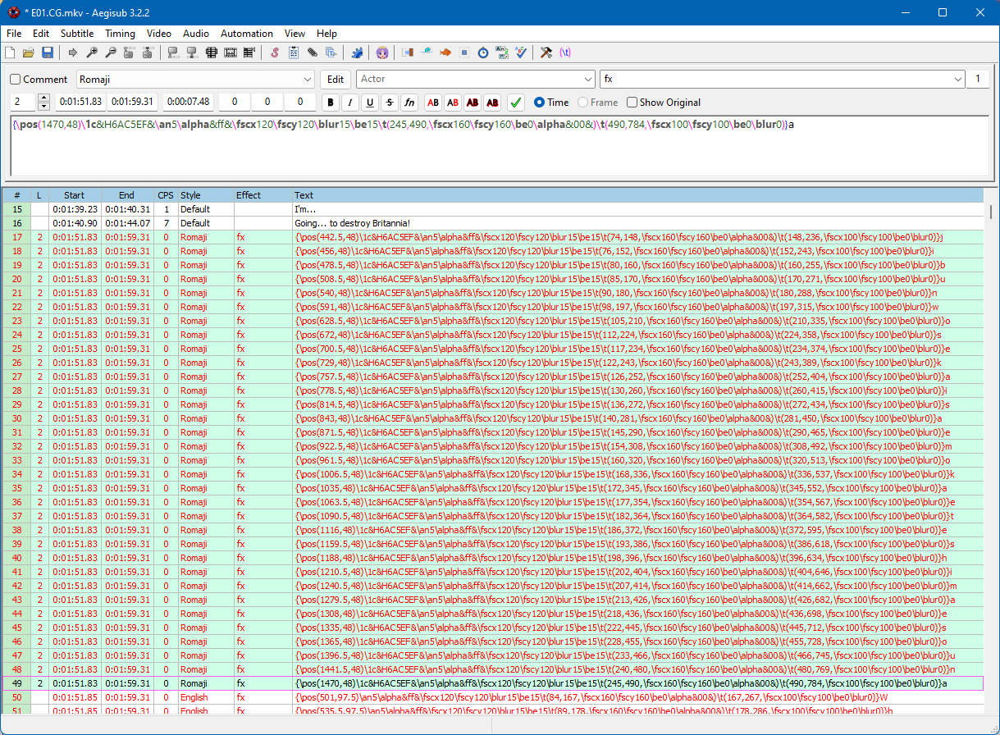

# `AVFrame` - The need for separate `start_pts` and `duration` fields for Subtitles

In the following, I assume that the reader is roughly familiar with the ideas and concepts which are introduced by my [Subtitle Filtering 2022](https://github.com/ffstaging/FFmpeg/pull/18) patch set.

#### Motivation

This text is about explaining the necessity of having additional start_pts and duration fields for subtitles which are carried by an `AVFrame`: https://github.com/ffstaging/FFmpeg/pull/18/files#diff-e8b6f65310a38d7d9f37f85235c4cf6bd5bfef75792f0ee4eecc4098599807a7R736-R751

Multiple reasons exist for this requirement, there's one part of them being required immediately and another part is about keeping a level of flexibility for all kinds of requirements that may arise in the future. 

## Flexibility for Future Evolvement

It would really be a bad idea to introduce something so important and valuable like **Subtitle Filtering** in a way where you would know from day #1 that there are limitations that could never be overcome with the chosen model. And that is one important point about having those separate time value fields: 

It provides a high degree of flexibility, making it suitable for handling cases well about which we might not even think about right now (and those which I have already thought about but not implemented yet).

But let's focus on the 

## Immediate Requirements

### Why "Subtitle Filtering"?

Possible use cases and feature potential of Subtitle Filtering is immense, but why use FFmpeg filtering instead of choosing some other model or API for this? 

Because

- Filtering is a well established and well-working pattern in FFmpeg for video and audio
- It just fits perfectly and intuitively as a user-facing "API", both for programming and ffmpeg CLI use
- There are often interactions between various media types (a, v, s), which makes a uniform model desirable

There are also adverse reasons

- Subtitle streams are different from audio and video in many ways
- Also, subtitle streams itself are very different from other subtitle streams - there's a wide range of subtitle formats, codecs, capabilities, and representation in different containers
- At the top level we have the group of text subtitles and the group of bitmap subtitles 
  with different behaviors, requirements and rules
- These rules do not always match the semantics that we have implemented for audio and video "frames"

### Timing

Each subtitle event has a start time and in most cases a duration as well. As we are using `AVFrame`s for carrying subtitle events, this might appear just like a perfect match at first sight: 

- We can use the `AVFrame.pts` field for the display start time
- Maybe even `AVFrame.pkt_duration` for the duration?

For the duration it would get a bit confusing because a `pkt_duration` field doesn't quite match the meaning of a "subtitle display duration" and is already used on different ways. My conclusion is that a dedicated field (subtitle-duration) is needed and re-purposing the pkt_duration doesn't make much sense.

Ok, but can we use `AVFrame.pts` for the start times? In many cases: yes - but not always!

### Monotonicity Requirements
#### In FilterGraphs

The current (and not easily changeable) filtering implementation in FFmpeg relies on strictly increasing pts values of `AVFrame`s which are traveling through a filter graph. Otherwise, filter processing can block in certain situations.

#### In Containers

The situation is mixed in this regard: 

- Some containers require strictly increasing PTS values
- Other containers support non-strict monotonically increasing PTS values

#### Conclusion

We need to have subtitle PTS values which are strictly increasing - otherwise filtering may hang or muxing errors might occur.

# Examples

In earlier talks and chats on IRC with other developers, I probably made the mistake of focusing and explaining some of the more complex cases to illustrate the requirements for those fields, which sometimes left some doubts about whether the dual fields would "really" be required.

At this time, I want to show a very simple example, which - alone - already sufficiently justifies the dual start_pts fields.

## ASS Subtitle Input

Here's a screenshot from Aegisub, one of the most popular authoring applications for ass subtitles:

You can see that the 32 marked lines all have the same start and end display time.

This is an MKV, and MKV is tolerant to duplicate PTS values, which means that what we would normally get is 32 AVFrames having all the same ->pts value.
As this can cause muxing issues and/or cause filter graphs to hang, the decode_subtitles() function in ffmpeg.c ensures that a decoded subtitle frame's pts is at least the previous subtitle event's PTS + 1.

This makes sure that the frames will properly travel through the filter graph and you won't see any muxing errors.

### Summary

We need to modify the frames' pts values to make them be treated and behave like in case of audio or video streams.

This modification would change the subtitling - unless - we would be storing  start_pts and duration in separate fiields which are constant and never changed - and that's how it's done.

